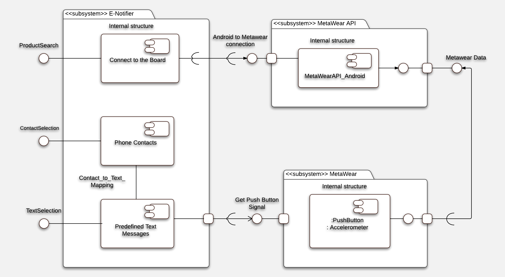

# E-Notifier 
This android app uses a MetaWear board as a simple and interactive notification system, utilizing Bluetooth low energy. 

### Executive Project Summary

Sometimes there arises a situation where an elderly or disabled person becomes incapacitated and is unable to contact a caregiver or an emergency service using conventional methods such as phone calls or text messages. E-Notifier offers a practical and convenient solution to this, unfortunately, common situation. Many similar medical alert systems are on the market today, however, these systems are bulky, unfashionable, and serve no other purpose except to be used during emergencies. E-Notifier is small enough to be both wearable and customizable. Customers can wear the button as a necklace or bracelet to match personal style, but also have the option of carrying it in their pocket or handbag. The system is an android application based, a noteworthy improvement on the traditional beacon based systems. In this application, users can set predefined emergency contact(s) to call or text a predefined message during an emergency with just a push of a button, avoiding the hassle of finding and unlocking the phone. E-Notifier can also be used to keep the customer up to date on their phone or social media. The various LED lights can be programmed to alert for text messages, calls, or social media updates. 

#### Project Goals

* Develop an android application which can integrate with the MetaWear device.
* Develop a simple and intuitive user interface.
* Make sure that MetaWear device and android app maintains connectivity.
* Test the application to ensure the functionality.
* Test the application against security vulnerabilities. 

#### Project Merits 

* E-Notifier is open source, easy to use, and portable.
* Real time notifications in the E-Notifier give more functionality than other systems on the market and ensures that has a positive and productive experience with the product. 
* Overall, E-Notifier is a simple to use application that solves a common problem faced by elderly and disabled people who want to live more independent lifestyles. The system is also more user friendly and functional than other competitive systems.

### Project Timeline

### Project-Oriented Risk List

|Risk name (value)  | Impact     | Likelihood | Description | Mitigation |
|-------------------|------------|------------|-------------|------------|
|Bluetooth range (42) | 7 | 6 | Bluetooth has limited range, and there are different range barriers. The device should always be in the Bluetooth radius. | Cleary specify and define the Bluetooth range limitations while designing the application. |
|Authentication (40) | 8 | 5| MetaWear device doesn't have a secure authentication mechanism. | Research ways to implement a secure authentication mechanism. |
|Bluetooth Sniffing (35) | 5 | 7 | Anyone with a sniffing device, such as Ubertooth, can easily listen to all the communication between BLE devices. | Implement strong pairing procedures and turn off the bluetooth when it is not necessary.| 
|Time Limitations (20) | 5 | 4 | Time could run short if not used properly, as there is limited time. | Prioritize the tasks. |
|Device Sensor Failure (10) | 5 | 2 | The sensors on the device are exposed and vulnerable as there is no case cover. | Get a case cover and handle with care. |   

### Application Requirements 

#### User Stories

As a **person in need**, I want to **send predefined message to my emergency contact(s)** so I can **get help**.

Acceptance Criteria:
  * On the push of a button, the user should be able to send an emergency text message
  * On the shake of a wearable, the user should be able to send an emergency text message 

As a **social networking user**, I want to **get notifications on the wearable device** so I can **stay connected with my contacts**.

Acceptance Criteria:
  * LED's on the MetaWear device should blink on getting sms, call, and social media notifications. 

As a **person in need**, I want to **call my emergency contact(s)** so I can **quickly get help**.

Acceptance Criteria:
* On the push of a button, the user should be able to make a call to any emergency contact.

#### Misuser Stories

As a **malicious user**, I want to **launch a man-in-the-middle attack** on the wearable device so I can **alter and steal user’s information**.

Mitigation:
  * Use end-to-end encryption and connect to only trusted devices.

As a **malicious user**, I want to **launch a denial of service attack** on the wearable device so I can **crash the device and impede the availability**.

Mitigations:
  * Set Bluetooth devices to the lowest necessary and sufficient power level so that transmissions remain within the secure perimeter of the organization.
  * Bluetooth devices should be configured by default as undiscoverable and remain undiscoverable except as needed for pairing.

As a **malicious user**, I want to **launch a spoofing attack** on the wearable device so I can **impersonate the authenticated user**.

Mitigations:
  * Connect only to trusted devices and try not to send any sensitive information.
  * Ensure device mutual authentication is performed for all connections.

### Architectural Diagram

* E-Notifier App
  * ProductSearch : User searches for the available MetaWear device and makes connection to the board
  * ContactSelection : User selects already saved emergency contacts from the phone
  * TextSelection : User selects predefined emergency text messages from the application
* MetaWear API
  * Connects and controls the MetaWear board from the E-Notifier App
* MetaWear Board
  * Sends the push button data to the E-Notifier app
  * Send the Accelerometer data to the E-Notifier app
  
### Hardware/Software Requirements

* Android 4.4+ (API Level 19 +) with Bluetooth LE capable smart phone or tablet
* [MetaWear device](https://mbientlab.com/product/metawearr/)
* [Android Studio](https://developer.android.com/studio/index.html)
* [Java Development Kit](http://www.oracle.com/technetwork/java/javase/downloads/index-jsp-138363.html)

### Installation

* Clone this repository using `git clone https://github.com/vingle1/E-Notifier.git`
* Open this folder in Android Studio
* In Android Studio under the Build tab: 
  * Click on Clean Project
  * Click on Rebuild Project
* Run the app on targeted Android device through ADB (Android Device Bridge)
* If you want to bypass the installation steps, you can also [directly download the app here](E-Notifier.apk) on your Android phone or computer  

### Getting Started

1. Connect a MetaWear board to the app 
1. Enter a contact name and select a contact(s) from the list. Contacts can be removed by holding the names in the selected contacts list 
1. Select the messages you want to send in the Set Messages menu 
1. A text message can be sent to your contacts by either pressing the onboard button or shaking the board
1. Disconnect the MetaWear and Android device using the Disconnect button

  
  
