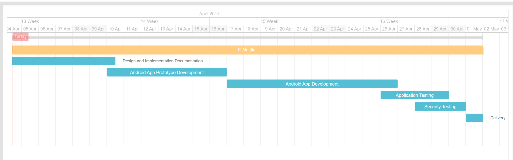

# E-Notifier 
This android app uses a MetaWear board as a simple and interactive notification system, utilizing Bluetooth low energy. 

### Executive Project Summary

Sometimes there arises a situation where an elderly or disabled person becomes incapacitated and is unable to contact a caregiver or an emergency service using conventional methods such as phone calls or text messages. E-Notifier offers a practical and convenient solution to this, unfortunately, common situation. Many similar medical alert systems are on the market today, however, these systems are bulky, unfashionable, and serve no other purpose except to be used during emergencies. E-Notifier is small enough to be both wearable and customizable. Customers can wear the button as a necklace or bracelet to match personal style, but also have the option of carrying it in their pocket or handbag. The system is an android application based, a noteworthy improvement on the traditional beacon based systems. In this application, users can set predefined emergency contact(s) to call or text a predefined message during an emergency with just a push of a button, avoiding the hassle of finding and unlocking the phone. E-Notifier can also be used to keep the customer up to date on their phone or social media. The various LED lights can be programmed to alert for text messages, calls, or social media updates. 

#### Project Goals

* Develop an android application which can integrate with the MetaWear device.
* Develop a simple and intuitive user interface.
* Make sure that MetaWear device and android app maintains connectivity.
* Test the application to ensure the functionality.
* Test the application against security vulnerabilities. 

#### Project Merits 

* E-Notifier is open source, easy to use, and portable.
* Real time notifications in the E-Notifier give more functionality than other systems on the market and ensures that has a positive and productive experience with the product. 
* Overall, E-Notifier is a simple to use application that solves a common problem faced by elderly and disabled people who want to live more independent lifestyles. The system is also more user friendly and functional than other competitive systems.

### Project Timeline

### Project-Oriented Risk List

|Risk name (value)  | Impact     | Likelihood | Description | Mitigation |
|-------------------|------------|------------|-------------|------------|
|Bluetooth range (42) | 7 | 6 | Bluetooth has limited range, and there are different range barriers. The device should always be in the Bluetooth radius. | Cleary specify and define the Bluetooth range limitations while designing the application. |
|Authentication (40) | 8 | 5| MetaWear device doesn't have a secure authentication mechanism. | Research ways to implement a secure authentication mechanism. |  

### Application Requirements 

#### User Stories

As a **person in need**, I want to **call my emergency contact(s)** so I can **quickly get help**.

As a **person in need**, I want to **send predefined message to my emergency contact(s)** so I can **get help**.

As a **social networking user**, I want to **get notifications on the wearable device** so I can **stay connected with my contacts**. 

#### Misuser Stories

As a **malicious user**, I want to **launch a man-in-the-middle attack** on the wearable device so I can **alter and steal user’s information**.

As a **malicious user**, I want to **launch a denial of service attack** on the wearable device so I can **crash the device and impede the availability**.

As a **malicious user**, I want to **launch a spoofing attack** on the wearable device so I can **impersonate the authenticated user**.
